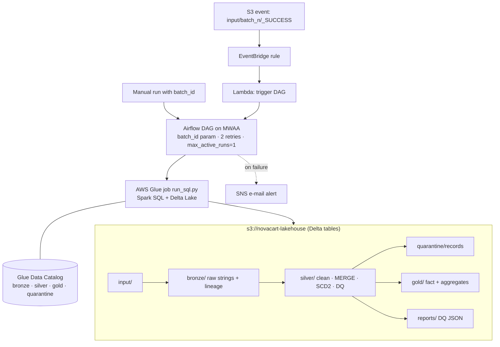

# NovaCart Order Analytics — Medallion Lakehouse on AWS

**Hackathon submission.** This is an automated Bronze → Silver → Gold pipeline for September 2026 orders.
It runs on **Amazon S3 + Delta Lake + AWS Glue (Spark SQL) + Glue Data Catalog**, orchestrated by **Airflow on MWAA**, with **EventBridge/Lambda** triggers and **SNS** alerts.

> **Result in one line:** the full pipeline logic is built and validated on the real hackathon files.
> Batch 1 → batch 2 → batch 2 re-run gives the correct answer every time, and the re-run changes **0 rows**.
> Gold revenue matches an independent recalculation **to the cent**.

---

## Status at the deadline

| Area | Status | Evidence |
|---|---|---|
| Bronze / Silver / SCD2 / Gold SQL (9 step files) | ✅ Complete | [`sql/`](sql) |
| Idempotency (bronze slice replace, `MERGE` with `updated_at >` guard) | ✅ Validated | [`local_test/expected_results/idempotency_check.json`](local_test/expected_results/idempotency_check.json) |
| Data quality report + quarantine + reconciliation asserts | ✅ Validated | [`dq_report_batch_1.json`](local_test/expected_results/dq_report_batch_1.json), [`dq_report_batch_2.json`](local_test/expected_results/dq_report_batch_2.json) |
| Gold results on the real files | ✅ Validated | [`local_test/expected_results/`](local_test/expected_results) |
| AWS infrastructure: S3 lakehouse, Glue databases, IAM role, SNS topic | ✅ Created in our AWS account | [`infra/01_create_core.sh`](infra/01_create_core.sh), screenshots in [`docs/screenshots/`](docs/screenshots) |
| Glue job runner (`run_sql.py`) | ✅ Code complete | [`glue/run_sql.py`](glue/run_sql.py) |
| Glue job execution on AWS | ⛔ Blocked: `CreateJob` returns *"Account … is denied access"* (account-level restriction on Glue, not a code issue) | screenshot |
| Airflow DAG (batch_id param, 2 retries, `max_active_runs=1`, SNS on failure) | ✅ Code complete, not deployed (needs Glue) | [`dags/novacart_medallion_dag.py`](dags/novacart_medallion_dag.py) |
| S3 `_SUCCESS` → EventBridge → Lambda trigger | ✅ Code complete, unit-tested with mocks | [`lambda/trigger_dag_lambda.py`](lambda/trigger_dag_lambda.py) |
| Delta evidence (history, time travel, schema enforcement, OPTIMIZE, CDF) | ✅ Script ready | [`evidence/run_evidence.py`](evidence/run_evidence.py), [`local_delta/run_local_delta.sh`](local_delta/run_local_delta.sh) |

---

## Architecture



| Step | Layer | Key logic |
|---|---|---|
| [`01_bronze`](sql/01_bronze.sql) | Bronze | All columns as STRING, `_source_file`, `_batch_id`, `_ingested_at`. `DELETE` + `INSERT` per batch makes it idempotent. |
| [`02_silver_orders`](sql/02_silver_orders.sql) | Silver | 3 timestamp formats → UTC, currency fix/derive, quarantine, dedup, `MERGE … WHEN MATCHED AND s.updated_at > t.updated_at`. |
| [`03_silver_reference`](sql/03_silver_reference.sql) | Silver | FX, products, CRM (no `updated_at` → quarantine), payments (unknown order → quarantine). |
| [`04_silver_order_items`](sql/04_silver_order_items.sql) | Silver | Null discount = 0, unknown product flagged, orphan line quarantined, `MERGE`. |
| [`05_dim_customer`](sql/05_dim_customer.sql) | Silver | SCD Type 2 on tier/country, hash `customer_sk`, unknown member `-1`. |
| [`06_gold_fact_order_line`](sql/06_gold_fact_order_line.sql) | Gold | Net local, FX as-of (last business day), net USD, revenue flag, point-in-time customer. |
| [`07_gold_aggregates`](sql/07_gold_aggregates.sql) | Gold | Daily revenue, revenue by category, top 10 customers, payment mismatches. |
| [`08_dq_and_optimize`](sql/08_dq_and_optimize.sql) | All | `assert_true` reconciliation, DQ JSON export, `OPTIMIZE … ZORDER BY`. |

---

## Results on the real hackathon files

| Check | Batch 1 | Batch 2 | Batch 2 re-run |
|---|---|---|---|
| `silver.orders` rows | 495 | 945 | 945 — **0 changed** |
| Orders MERGE (updated / inserted) | 0 / 495 | 137 / 450 · **10 stale versions rejected** | **0 / 0** |
| `silver.order_items` rows | 971 | 1,933 | 1,933 — **0 changed** |
| Fact lines / revenue lines | 971 / 766 | 1,933 / 1,660 | identical |
| Total revenue (USD) | — | **295,585.58** | identical |
| Payment mismatches | — | **14 orders** | identical |

**Revenue by category:** Electronics 223,943.51 · Fashion 20,869.65 · Sports 18,413.67 · Home 15,924.47 · Beauty 9,639.45 · Books 3,834.98 · UNKNOWN 2,959.85.

**Data traps found and handled.** Every one is counted in the DQ report:
- **Timestamps:** 3 formats (`Z`, `+05:30`, `dd/MM/yyyy HH:mm`).
- **Currency:** lower-case values; 194 blank currencies derived from `shipping_country`.
- **Order versions:** 1,871 superseded or duplicate versions.
- **Cross-batch orders:** 10 out-of-order older versions in batch 2, and 36 batch 2 lines whose order arrived in batch 1.
- **Orphans:** 18 orphan lines (`NC-9900xx`) and 5 orphan payments (`NC-8000xx`).
- **Unknown references:** unknown products P101–P105 and unknown customers C0901–C0906.
- **CRM:** 5 rows without `updated_at`, plus duplicates and email-only changes.
- **FX:** rates on business days only.

Full list and the assumptions: [`docs/DESIGN_NOTE.md`](docs/DESIGN_NOTE.md).

---

## How to run
| Goal | Command |
|---|---|
| Full AWS deployment (needs Glue enabled on the account) | `ALERT_EMAIL=you@x.com BUCKET=<bucket> ./infra/quick_run.sh` |
| Real Delta Lake on a laptop (Java 17 + Python 3.12) | `./local_delta/run_local_delta.sh` |
| Logic test without the Delta jar | `./local_test/run_local_test.sh` |

The step-by-step runbook (IAM, MWAA, trigger, evidence, teardown) is in [`docs/RUNBOOK.md`](docs/RUNBOOK.md).

## Repository map
```
sql/            the pipeline (00_setup … 08_dq_and_optimize)
glue/           run_sql.py – Glue job runner
dags/           Airflow DAG for MWAA
lambda/         S3 _SUCCESS → DAG trigger
infra/          AWS setup scripts + IAM / EventBridge JSON + teardown
evidence/       Delta evidence (history, time travel, schema test, OPTIMIZE, CDF)
local_delta/    run the real Delta pipeline locally
local_test/     logic test harness + expected results from the real files
input/          hackathon input files
docs/           design note, runbook, screenshots
```

## AI usage
An AI assistant (Claude) helped design the architecture and draft the SQL, scripts and documentation. All logic was profiled against the real input files, run end to end, and cross-checked with an independent calculation. The team can explain every line.
# rocket
